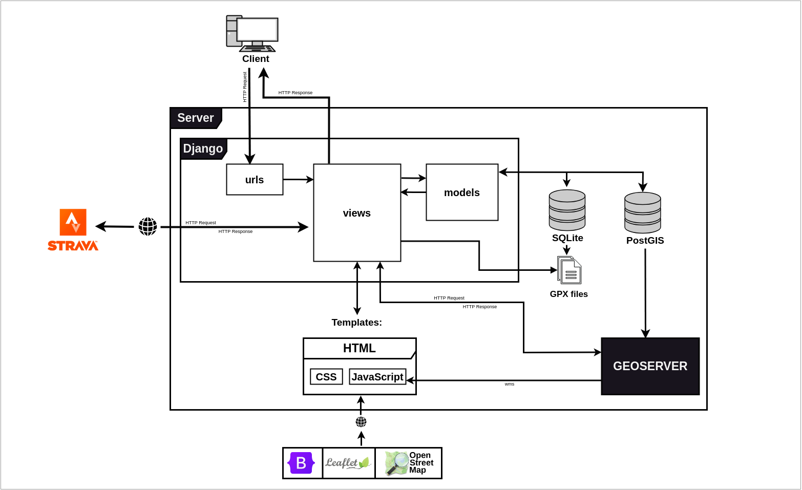
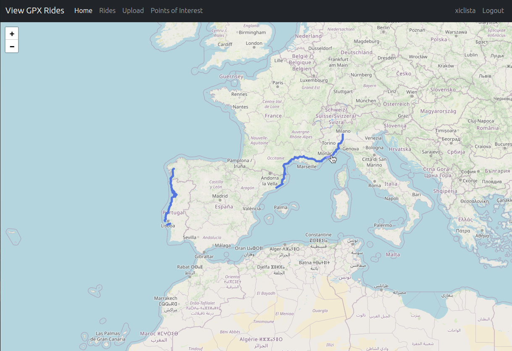
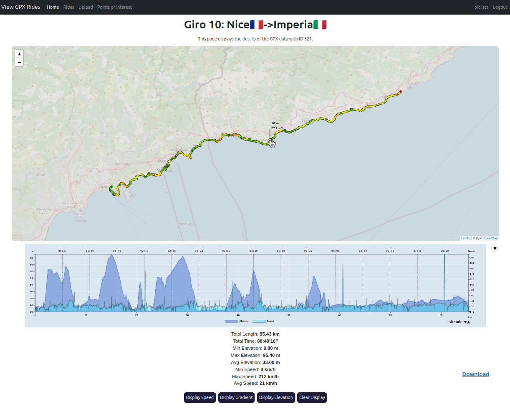
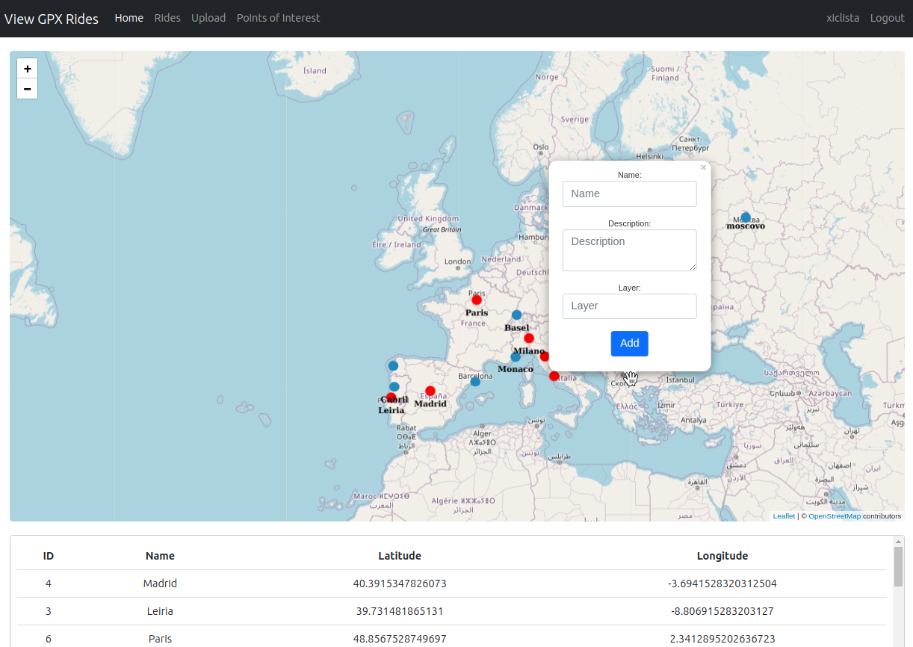
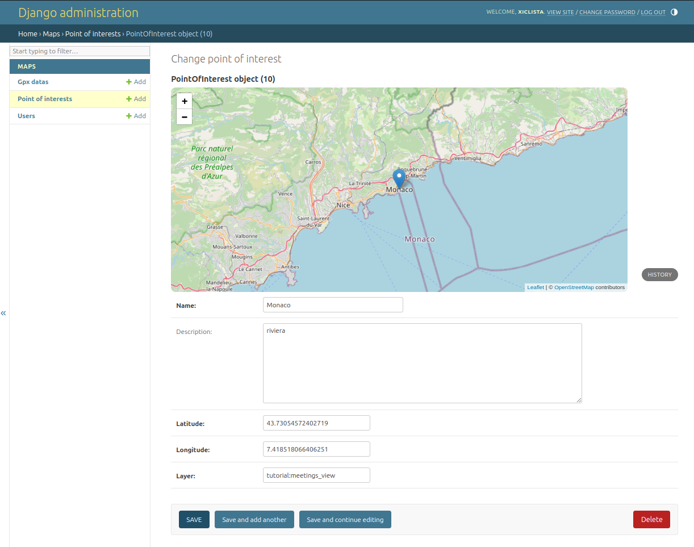

# View GPX Rides - Webapp

**A Comprehensive Django Webapp for Analyzing and Visualizing Your Cycling Adventures**

This is a Django project created for learning purposes. The code may not be optimized for production use. If you plan to use it, be cautious and consider refactoring it for your specific needs.

## Description

View GPX Rides is a user-friendly web application built with Django that empowers cyclists to delve into their ride data and gain valuable insights. It offers a comprehensive suite of features to:

- **Upload GPX Files:** Effortlessly upload GPX files containing ride data to the application for detailed analysis.

- **Strava API Integration:** Connect your Strava account to import your rides into View GPX Rides, eliminating the need for manual uploads.

- **Points of Interest (POI) Management:**
  
  - **Geoserver Integration:** Define points of interest (POIs) directly through the web app and it will display on the leaflet map using Geoserver.
  - **PostgreSQL Database Support:**  PostgreSQL is currently used only for POIs.

- **Interactive Map Visualization:**
  
  - **Combined Ride Overview:** View all your rides plotted together on a map, providing a comprehensive picture of your cycling journey.
  - **Detailed Ride Analysis:** Select individual rides explore specific ride data in a clear and informative manner.



## Installation


- **Create a Virtual Environment (Recommended):** Isolate project dependencies using a virtual environment to avoid conflicts with system-wide packages. You can use tools like `venv` or `virtualenv` for this purpose.

- **Activate the Virtual Environment:** Activate the virtual environment to ensure commands are executed within its isolated context.

- **Install Dependencies:** Navigate to your project directory and run `pip install -r requirements.txt` to install the required libraries.

```
- Django
- gpxpy
- polyline
- Requests
- stravalib
```

- **Database Setup:**
  
  - **SQLite (Default):** No additional configuration is typically needed for SQLite (the default database).
  - **PostgreSQL (Optional):** If using PostgreSQL, configure the database connection details in `settings.py`.
  
  **Geoserver Integration (Optional)**
  
  While View GPX Rides leverages Geoserver for POI management, Geoserver is a separate software product. Here are some resources to get you started with Geoserver installation:
  
  - **Geoserver Official Website:** [https://geoserver.org/](https://geoserver.org/)
  - **Geoserver Installation Documentation:** [GeoServer User Manual &#8212; GeoServer 2.26.x User Manual](https://docs.geoserver.org/main/en/user/index.html)
  
  You need to integrate the Geoserver with the same PostgreSQL database that you are using in the django project, specifically the same table you are using for the POI's, only this way you will be able to see the points of interest on the map.

- **Run Migrations:** Run `python manage.py migrate` to create the necessary database tables for the POI's.

- **Start Development Server:** Run `python manage.py runserver` to launch the development server and access the application locally (usually at http://127.0.0.1:8000/).


## Usage

- **Access the Application:** Open http://127.0.0.1:8000/map in your web browser or if you are an admin and you want to control the webapp, go to [http://127.0.0.1:8000/admin](http://127.0.0.1:8000/admin).

- If you want the full functionalities, create an user in the register page and the proceed to the login page.


### Project Showcase

**Screenshots:** Get a glimpse of View GPX Rides in action! The following screenshots showcase the application's interface and functionalities.










